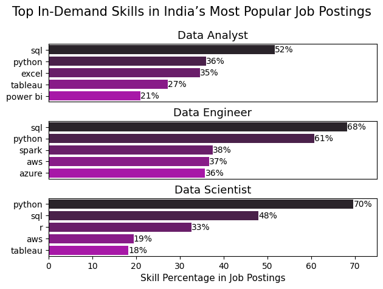
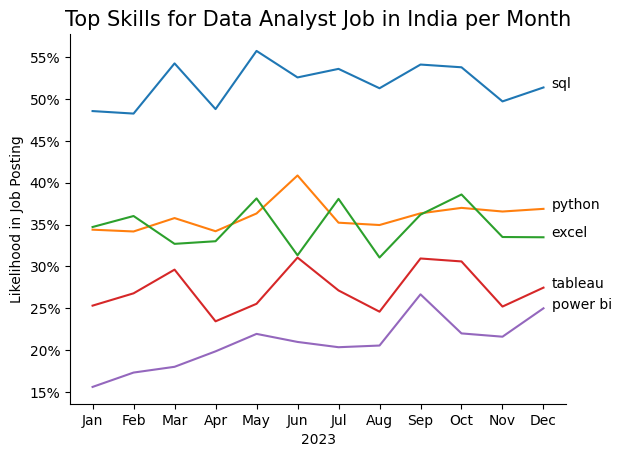
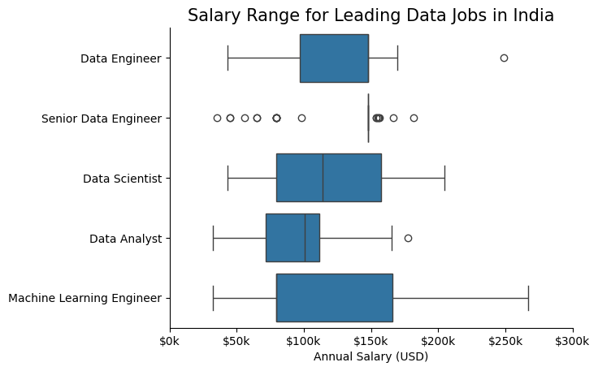
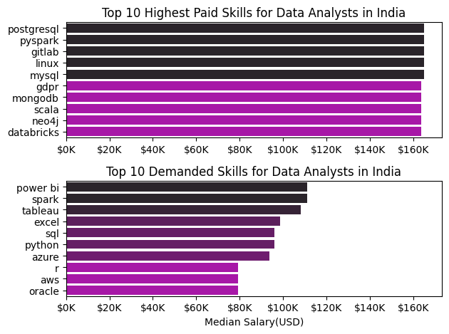
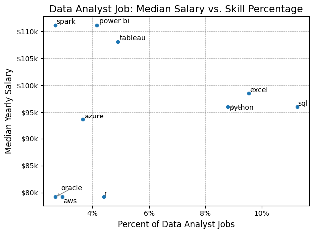

# Overview
Welcome to my analysis of data jobs. The aim of this analysis is to explore specific data analysis jobs, uncover trends, and guide individuals eager to join the data analysis tech space on the various skills to learn, salary expectations, and how these skills have trended throughout the year.

The data is obtained from [lukebarousse/data_jobs](https://huggingface.co/datasets/lukebarousse/data_jobs). It contains 785,741 rows and 17 columns, providing a wide range of vital details, including job salaries, required skills, and job posting platforms.

# Questions
Here are the questions this project aims to address:

1. What are the skills most in demand for the top 3 most popular data roles?
2. How are in-demand skills trending for Data Analysts?
3. How well do jobs and skills pay for Data Analysts?
4. What are the optimal skills for data analysts to learn? 

# Tools I Used for my Analysis
 - Python: A flexible programming language that allowed me to write and run code. It comes with an interpreter to execute my scripts and supports many libraries, such as :
   - Pandas: 
Pandas library enabled me work with tabular data. It made it easy to clean, analyze, and manipulate the dataset, allowing me to perform tasks such as filtering, sorting, and summarizing the dataset in a simple and efficient way.
   - Matplotlib: Matplotlib library was used for creating interactive, and animated visualizations, such as charts and graphs. It allowed me to plot data and customize the appearance of my visuals.
   - Seaborn: Seaborn library is built on top of Matplotlib and provides a higher-level interface that enabled me create attractive and informative visual. It simplified the process of creating complex visualizations, especially for analyzing data patterns and relationships.
- Visual Studio Code (VSC): VSC is the code editor I used to write and run my python code.

# Data Preperation and Cleanup
In this section, I imported the necessary libraries and dataset for analysis. I then formatted the dataset for proper analysis and filtered it to include only job postings in India to make my analysis more specific.

## Import Required Libraries and Dataset
First, I imported the required libraries and the dataset
``` python
# Import required libraries
import datasets
import pandas as pd
import matplotlib.pyplot as plt
import seaborn as sns
import ast

# Import dataset
from datasets import load_dataset
dataset = load_dataset('lukebarousse/data_jobs')
df = dataset['train'].to_pandas() 
```

## Data Cleanup and Filtering
Here, I cleaned the dataset and filtered it to include only job postings in India, following the initial import of libraries and the dataset.
``` python
#Converted the datatype for job_posted_date from object to datetime and extracted the month from the dataset
df['job_posted_date'] = pd.to_datetime(df.job_posted_date)
df['job_posted_month'] = df.job_posted_date.dt.month

#Coverted the datatype for skill_list from string to list
def new_list(skill_list):  
   if pd.notna(skill_list): 
      return ast.literal_eval(skill_list)  
df['job_skills'] = df.job_skills.apply(new_list)

#Filter dataset for only job posting in India
df_India = df[df['job_country'] == 'India']
```
# Analysis
This section of the project presents the visuals and findings from the research

## 1. What are the most demanded skills for the top 3 most popular Data Roles?
To identify the most in-demand skills for the top three popular data roles, I calculated the frequency of various skills across their respective job titles. I then filtered the dataset for the top three job titles with the highest counts and calculated the percentage of each skill within these roles. Finally, I created a plot to display the top three data jobs alongside their most sought-after skills.

More details on the steps taken are provided here: [1_Skills_Request](2_Skills_Request.ipynb)
### Visualization Code
``` python
# Create a figure with multiple subplots (one for each job title)
fig, ax = plt.subplots(len(India_job_titles), 1)

# Loop through each India_job_title to generate a separate plot for each
for i, India_job_title in enumerate(India_job_titles):
   # Filter the top 5 skills for the current job title. 
  df_plot = India_skills_count[India_skills_count
  ['job_title_short'] == India_job_title].head(5)
  # Create a horizontal barplot for the current job title
  sns.barplot (data=df_plot, y='job_skills', x='skill_count', ax=ax[i], hue='job_skills', palette='dark:m') 

#Display the plot
plt.show()
```
### Result


### Insights
- In India, SQL is the most sought-after skill in both the data analyst and data engineer roles, accounting for 52% and 68% of job postings, respectively. However, in the data scientist role, it is the second most demanded skill.

- Python is the second most demanded skill in the data analyst and data engineer roles. For the data scientist role, Python is the most sought-after skill, appearing in 70% of job postings.

- Data engineer and data scientist roles are considered more advanced, as they both require advanced programming skills. Therefore, I would recommend a data newbie start with the data analyst role, which typically requires fewer complex skills, and work their way up to more advanced data roles.

## 2. How are In-Demand Skills Trending for Data Analysts?
To uncover trends in in-demand skills for data analysts, I derived the month column from various job postings, calculated the percentage of each skill's count per month, and visualized the top 5 skills for the year 2023.

More details on the steps taken are provided here: [2_Skills_Trend](3_Skills_Trend.ipynb)

### Visualization Code
``` python
#Plot a line plot
sns.lineplot(data=df_lineplot, dashes=False, legend='full', palette='tab10')
sns.despine()

# Add text labels for the last data point of each line to display the column names
for i in range(5):
    plt.text(11.2, df_lineplot.iloc[-1, i], df_lineplot.columns[i], color='black')

#Display the plot
plt.show()
```
### Result 

### Insights
- In India, SQL remains the most sought-after skill throughout the year, although its demand fluctuates. It tends to be less in demand at the start and end of the year compared to the middle of the year.

- The demand for Python remains relatively constant throughout the year, although there is an increase in demand for this skill around the middle of the year.

- The demand for other skills, such as Excel, Tableau, and Power BI, remains below 40% in job postings. However, the demand for these skills is lower at the start of the year compared to other times (excluding Excel), suggesting that these skills are still in demand in the data industry.

## 3. How well do Jobs and Skills Pay for Data Analysts?

To analyze how well jobs and skills pay for data analysts, I calculated and plotted the median salary for the job with the highest count. Next, I identified the top-paying data analysis skills and the skills with the highest count, plotting both on the same chart.

More details on the steps taken are provided here: [3_Skills_Earning](4_Skills_Earning.ipynb)

### Visualization Code Salary Range for Leading Data Jobs
``` python
# Creat a horizontal boxplot
sns.boxplot(data=df_India_top_jobs, x='salary_year_avg', y='job_title_short', vert=False, order=India_job_order)

# Remove the top and right spines of the plot
sns.despine()

# Format the x-axis to display salary values in thousands (e.g., 50k instead of 50000
ax = plt.gca() 
ax.xaxis.set_major_formatter(plt.FuncFormatter(lambda y, pos: f'${int(y/1000)}k'))

# Display the plot
plt.show()
```
### Result


### Insights
- In job postings in India, there is not much variation in salary for top jobs. For instance, the Data Engineer role has the same salary at the middle and upper salary ranges, with only one outlier.

- The Senior Data Engineer role has the same salary at the lower, middle, and upper salary ranges, indicating that a majority of its job postings lie within a salary figure of $146K, with the rest falling outside this range.

- Data Scientist and Data Analyst job salaries show variation but with very few outliers.

- In essence, based on this sourced data, there is not much variation in salaries across data roles in various industries in India, as majority of the salaries are centered within the same range.

### Visualization Code for In_Demand Skills and their pay
``` python
# Creat a figure with two subplots arranged in 2 rows and 1 column
fig, ax = plt.subplots(2, 1)

# Plot a horizontal bar chart 
sns.barplot(data=India_sal_median, x='median', y=India_sal_median.index, ax=ax[0], hue='median', palette='dark:m_r', legend=False)

# Plot a horizontal bar chart 
sns.barplot(data=India_sal_count, x='median', y=India_sal_count.index, ax=ax[1], hue='median', palette='dark:m_r', legend=False)

# Display the figure with both subplots
plt.show()
```

### Result


### Insights
- The skills with the highest pay are within the same range of over $160K. However, further analysis shows that the demand for these skills is very low.

- The sought-after skills for data analyst roles in India do not fall within the same salary range, but their pay is still significantly lower than the highest-paid skills. However, the demand for these skills is very high.

- I would recommend that a newbie start with these in-demand skills to be guaranteed a job offer and gain work experience after learning. Moreover, these skills are less complex than the highest-paid skills.

## 4. What are the most optimal skills to learn for Data Analyst
To identify the most optimal skills for data analysts, I filtered the dataset for roles labeled "data analyst", calculated the top ten highest-paying skills and the most frequent skills, and plotted them on a scatter plot for simultaneous comparison.

More details on the steps taken are provided here: [4_Optimal_Skills](5_Optimal_Skill.ipynb)
### Visualization Code
``` python
# Plot a scatter plot
India_skill_DA.plot(kind='scatter', x='percent', y='median')

# Set the y-axis formatter to display values in thousands (e.g., 50k instead of 50000)
ax = plt.gca()
ax.yaxis.set_major_formatter(plt.FuncFormatter(lambda y, pos: f'${int(y/1000)}k'))

# Add text annotations to each point in the scatter plot
texts = []
for i, txt in enumerate(India_skill_DA.index):
    texts.append(plt.text(India_skill_DA['percent'].iloc[i], India_skill_DA['median'].iloc[i], txt, fontsize=10))

# Display the plot
plt.show()
``` 
### Result


### Insights
- In India, as shown in previous analyses, SQL has the most job postings, accounting for up to 11% of job postings. However, this analysis shows that SQL is not the highest-paying skill, with an average yearly pay of around $95K.

- Spark, Power BI, and Tableau are the highest-paying skills among the top 10 skills, but their job postings are not as significant when compared to Excel and Python, which are in higher demand. However, their pay is higher than that of Excel and Python.

- The least-paid skills for data analysts are Oracle, AWS, and R, which appear to be cloud and programming skills.

# Lessons Learned from This Project
During my course of taking course and completing this project I've been able to understand python and its significance in data analysis. Some specific lessons learned are:

- I learned about various Python functions, the Python standard library, and libraries such as Pandas, Matplotlib, and Seaborn, and their overall importance in the data analysis process.

- I gained skills in cleaning and exploring datasets, including steps taken to ensure that visuals accurately reflect the dataset, such as filtering out null values and plotting percentages.

- I also learned which charts are most effective for specific analyses, as there are particular charts that best convey the message of the analysis.

- I learned how to write a standard report and how to host both my report and code on GitHub.

# Challenges Faced During Analysis
This project presented several challenges, but each offered valuable learning experiences:

- Handling Large Datasets: Managing and processing vast amounts of data from the dataset posed challenges, requiring effective strategies to maintain performance and prevent delays.

- Limited Data Variation in India: After filtering the dataset for India, the limited number of job postings led to less data variation. However, I was able to identify potential reasons for this and focus my analysis on those factors.

- Advanced Data Visualization:  Creating clear and impactful visualizations for complex datasets was a challenging task, but essential for effectively communicating key insights regarding analysis.

# Conclusion
In conclusion, this project provided both valuable insights and significant challenges. It enhanced my skills in data cleaning, visualization, and interpretation. This exploration of the data analyst job market has been highly insightful. The knowledge gained not only deepens my understanding but also offers practical advice for those seeking to advance their careers in data analytics. As the market continues to evolve, staying informed through continuous analysis will be crucial to maintaining a competitive edge. This project lays a solid foundation for future research and emphasizes the importance of ongoing learning and adaptability in the ever-changing data indstry.

